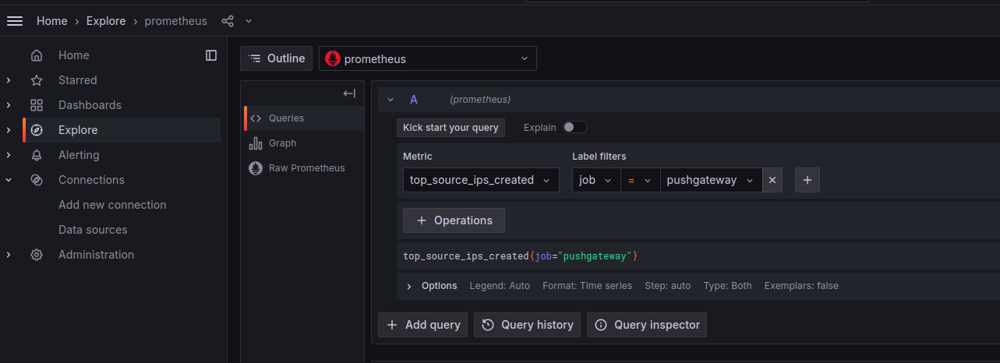

- Use virtualenv named myenv
- Update config:
sudo cp snort.lua /usr/local/etc/snort/snort.lua
- Add rules:
sudo cp local.rules /usr/local/etc/snort/rules/local.rules
- Run mininset:
sudo python3 topology.py
- Run asn static route:
+ sudo python3 asn_static_route.py
+ test ping:
 d1 ping google_2
- Run snort
sudo snort -i as2_r2-eth0 -c /usr/local/etc/snort/snort.lua
- Docker run services
docker-compose up -d
- Run aggregator
sudo myenv/bin/python3 snort_ddos_app.py

- Attack with:
+ h1 ping -f server1
+ h1 hping3 -1 --flood server1
+ h2 hping3 -i u5000 -S -p 80 server2

- Monitor Prometheus with:
http://localhost:9090/targets?search=
- Login grafana with:
http://localhost:3000
+ Username: admin
+ Password: admin

- Monitor grafana

- Delete the data with:
curl -X DELETE http://localhost:9001/metrics/job/snort_ddos_app